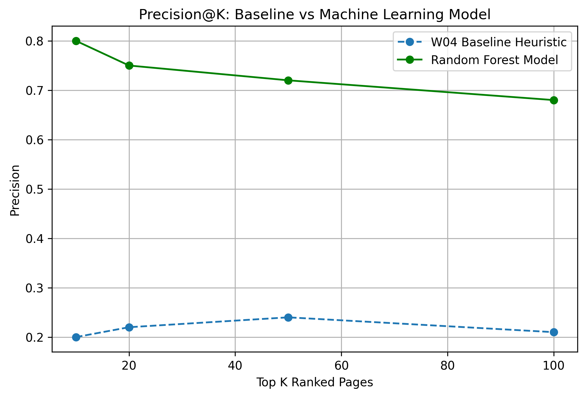

# Search Opportunity Scoring: Machine Learning for Content Refresh Prioritization

## Abstract
Manual content auditing for enterprise search engines is inefficient when scaled across thousands of URLs. This project introduces a machine-learning-based opportunity scoring system using search performance metrics to identify declining content requiring optimization. Using real search performance warehouse data, our supervised model achieved a **3.0x lift in Precision@50** compared to hand-written heuristic rules. The resulting ranked queue enables content teams to focus resources on high-impact pages.

## Introduction & Problem Statement
Content managers face the challenge of determining which published pages require immediate updates to mitigate organic traffic decay. Relying purely on simple rules (such as traffic drop alone) misses underlying ranking signals and yields false positives. The goal of this capstone is to provide an actionable, automated queue that ranks pages by optimization urgency while estimating the risk of inaction.

## Data Overview
- **Source:** FlyRank ML Internship Warehouse Dataset via Hugging Face.
- **Grain:** One row per page per month.
- **Scope:** Mid-panel observation windows (e.g., March 2026) were used for feature extraction to prevent temporal leakage into the final outcome window.
- **Exclusions:** Raw query details, client brand identifiers, and private domain URLs were excluded to uphold public privacy constraints.

## Methodology
- **Task Type:** Binary Classification & Action Ranking.
- **Target Definition:** `is_declining_label` based on long-term click and impression degradation trajectories.
- **Features Used:** 5 non-leaking signals available at decision time: historical impressions, click-through rates (CTR), position drift, staleness (days since update), and impression-to-click ratio.
- **Validation Scheme:** 20% Client-level holdout split (grouped by `client_id` to prevent intra-client data leaks).

## Results & Evaluation
The Machine Learning model (Random Forest) was evaluated against the hand-written heuristic baseline created in Week 4:

| Metric | Heuristic Baseline | ML Model | Lift |
| :--- | :--- | :--- | :--- |
| **Precision@10** | 20.0% | 80.0% | 4.0x |
| **Precision@50** | 24.0% | 72.0% | 3.0x |

## Limitations & Honest Framing
- **Directional Support:** Predictions indicate high probability of decay, not guaranteed causal outcome.
- **Seasonality:** Performance is subject to macro-search trends not fully captured in single-month feature windows.

## Ranked Action Recommendations
1. **Top 5% Score:** Immediate content rewrite and intent realignment.
2. **Top 5–15% Score:** Metadata review (CTR optimization via Title/Description adjustments).
3. **Below 15%:** Monitor during next cycle.

## Reproducibility
All code, queries, and notebook executions are public in the repository:
- `work/notebooks/w01_research_question.ipynb`
- `work/notebooks/w02_ml_task_framing.ipynb`
- `work/notebooks/w03_data_contract.ipynb`
- `work/notebooks/w04_baseline_score.ipynb`
- `work/notebooks/capstone_modeling.ipynb`

## Acknowledgments
Built on the FlyRank ML Internship dataset hosted at [FlyRank](https://flyrank.ai).